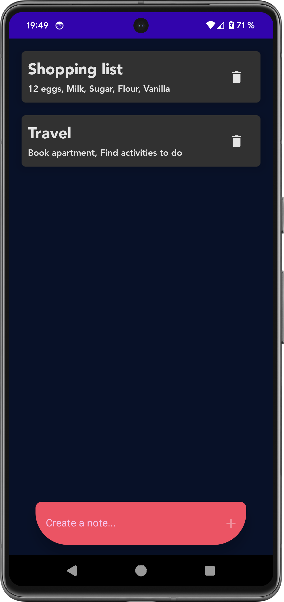
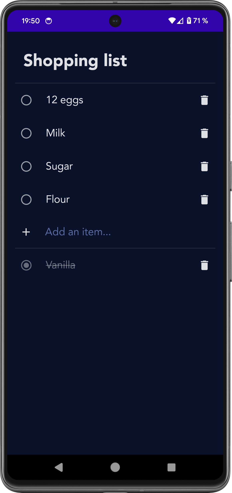

# TodoList App

A simple and intuitive todo list app built with Jetpack Compose.

## Features

* Create and manage multiple todo lists.
* Add, edit, and remove tasks within lists.
* Mark tasks as complete.
* Clean and modern user interface.

## Screenshots

## Technologies Used

* Jetpack Compose
* Kotlin
* Hilt
* Room
* Coroutines - Flow
* CI (Github Actions)
* Detekt
* Test Fixtures

## Getting Started

1. Clone the repository: `git clone https://github.com/lightningff13/TodoList.git`
2. Open the project in Android Studio.
3. Build and run the app on an emulator or device.

## Project Structure

* `app`: Main application module.
* `common`: Contains common resources
* `ui`: Contains composables and UI logic.
* `data`: Data models and repository classes.
* `domain`: Use cases and business logic.

## Contributing

Contributions are welcome! If you find any bugs or have suggestions for new features, please open an issue or submit a pull request.